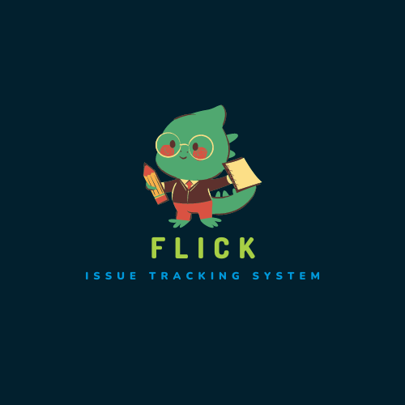
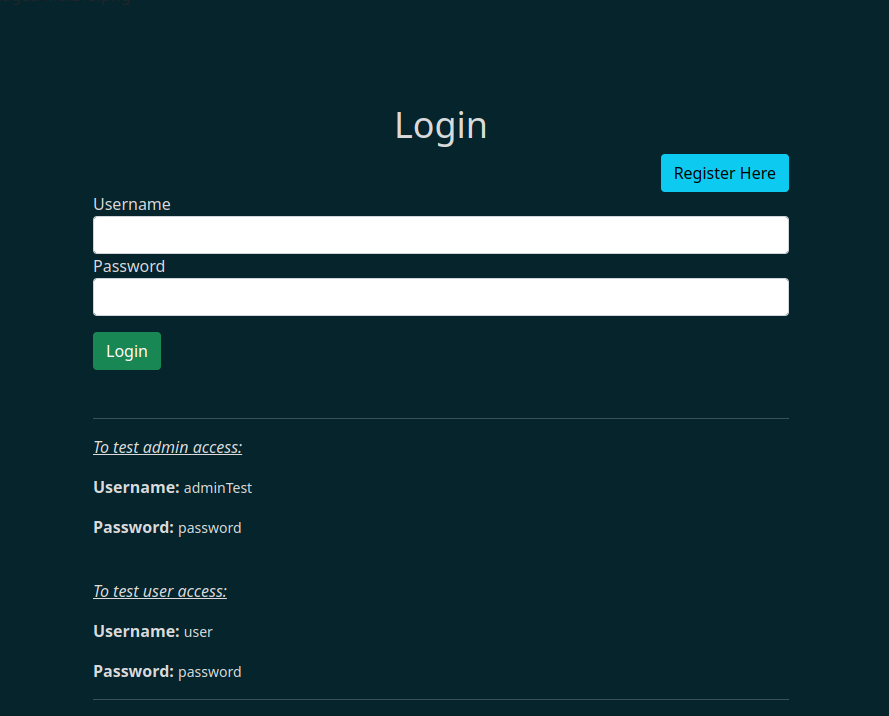
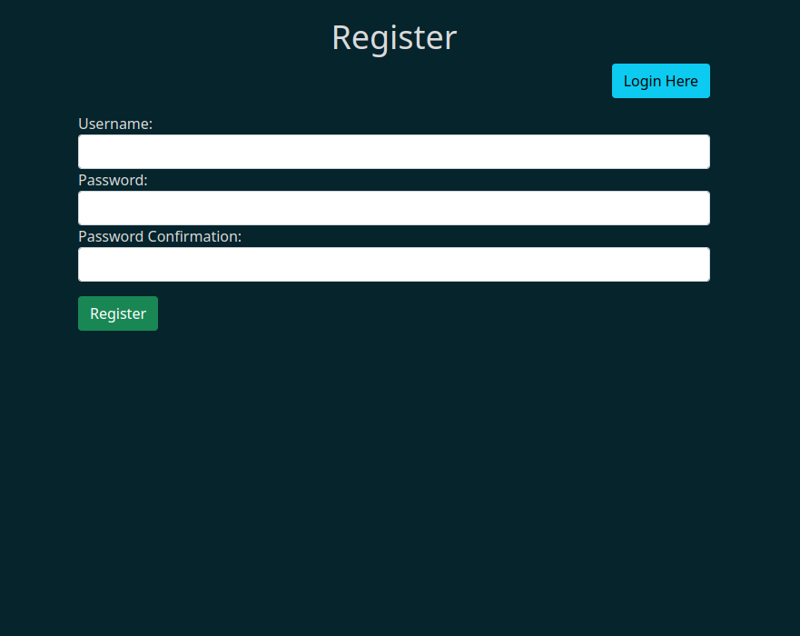
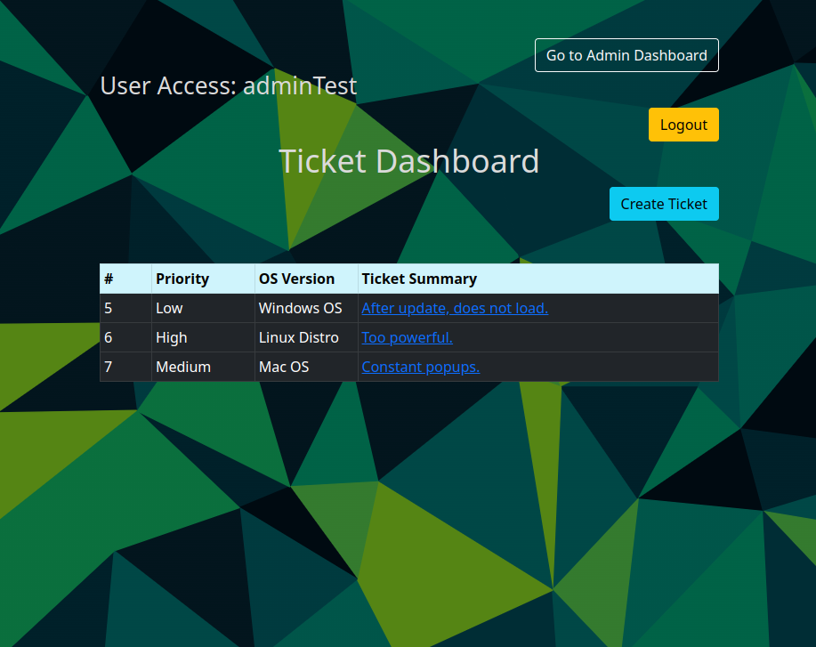
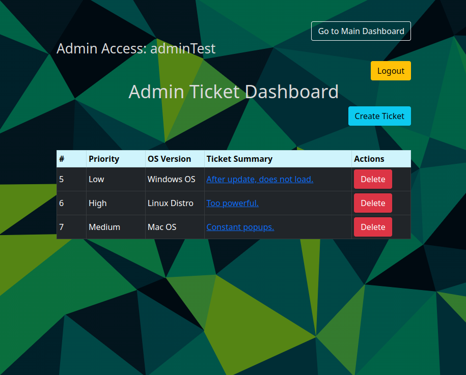
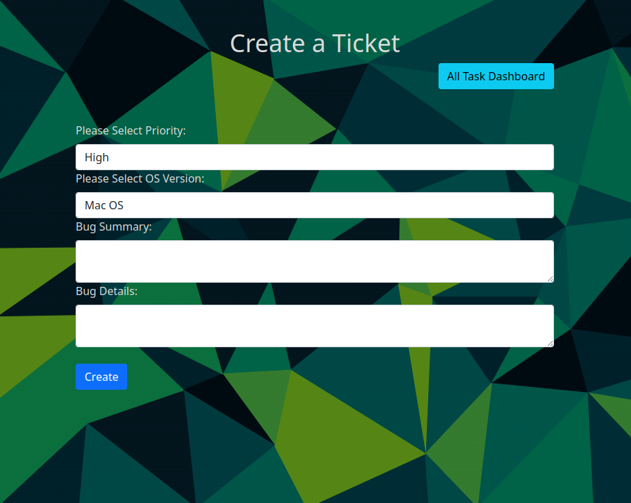
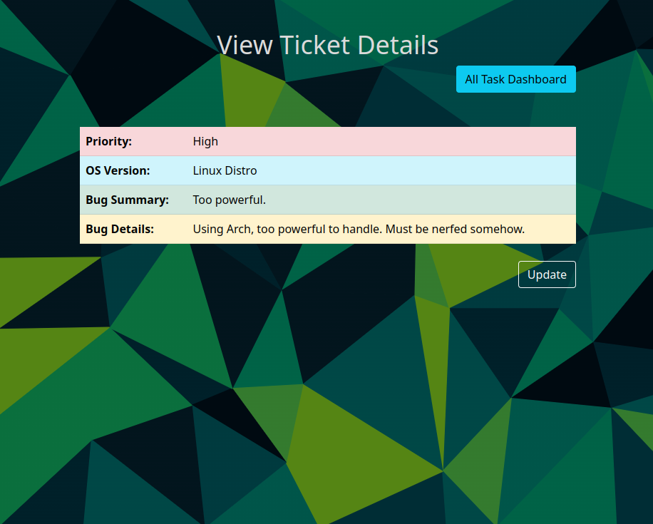

<!-- PROJECT LOGO -->
 

  

<h3 align="center">Flick ITS</h3>

  

    This is an MVP of an Issue Tracking System I am building that sorts issue according to a numbered severity system and OS with Admin and Tech/User access.
  

<!-- ABOUT THE PROJECT -->
## Built With

* Java
* Spring Boot
* Spring Security
* MySQL
* Bootstrap

(<a href="#top">back to top</a>)

<!-- USAGE EXAMPLES -->
## Future Updates

* Creating other language versions
* Expanding the criteria available for categorizing bugs/issues/tasks

(<a href="#top">back to top</a>)

<!-- LICENSE -->
## License

Distributed under the MIT License. See `LICENSE.txt` for more information.

(<a href="#top">back to top</a>)

## Demo

